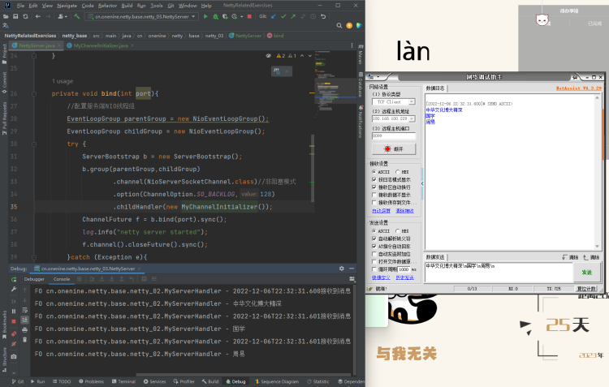

**增加字符串解码器**
在实际开发中，后端接收数据后我们希望是一个字符串或者是一个对象类型，而不是字节码，在Netty中提供了以下的能力：
1. 自动的把接收的Bytebuf数据转String，通过在管道pipline中添加一个StringDecoder
2. 网络传输过程中有半包粘包的问题，netty提供了很丰富的解码器，在正确合理的使用下就能解决半包粘包问题
3. 常用的字符串解码器：
   1. LineBasedFrameDecoder 基于换行
   2. DelimiterBasedFrameDecoder 基于指定字符串
   3. FixedLengthFrameDecoder 基于字符串长度
4. 还有一些处理其他数据格式的解码器，比如谷歌的protobuf数据格式

在本次的处理中涉及的内容：
- `MyChannelInitializer`中初始化Channel 时添加解码器
- `MyServerHandler`在接收客户端消息时不需要再进行手动解码
