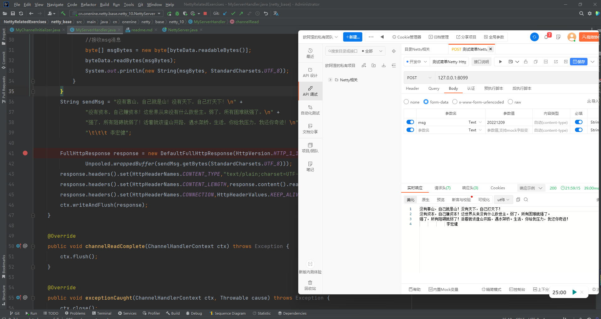

**实现Netty Http服务**

Netty不仅可以搭建Socket服务，也可以搭建Http、Https服务。本章节我们通过一个简单的入门案例，来了解Netty搭建的Http服务，在我们后续的Netty网关服务中会使用到这样的功能点。

超文本传输协议（HTTP，HyperText Transfer Protocol)是互联网上应用最为广泛的一种网络协议。
> 在后端开发中接触HTTP协议的比较多，目前大部分都是基于Servlet容器实现的Http服务，往往有一些核心子系统对性能的要求非常高，这个时候我们可以考虑采用NIO的网络模型来实现HTTP服务，以此提高性能和吞吐量，Netty除了开发网络应用非常方便，还内置了HTTP相关的编解码器，让用户可以很方便的开发出高性能的HTTP协议的服务，Spring Webflux默认是使用的Netty

