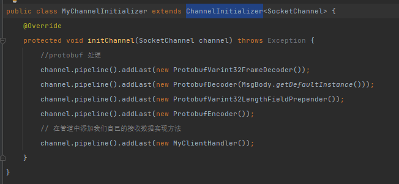

**Netty整合protobuf序列化方式**
> protocol官网地址：https://developers.google.cn/protocol-buffers
> Java相关文档：https://developers.google.cn/protocol-buffers/docs/javatutorial
> 可执行文件下载地址：https://github.com/protocolbuffers/protobuf/releases/tag/v21.11
**相关依赖**

```java
  <dependencies>
    <dependency>
      <groupId>com.google.protobuf</groupId>
      <artifactId>protobuf-java</artifactId>
      <version>${protobuf_version}</version>
    </dependency>
  </dependencies>
```
**使用**
- protobuf协议文件：`MsgBody.proto`
- 通过执行 :`E:\workspaces\protoc-21.11-win64\bin\protoc.exe -I=E:\workspaces\NettyRelatedExercises\netty_intermediate\netty_protocol\src\main\java\cn\onenine\netty\intermediate\protocol\proto --java_out=E:\workspaces\NettyRelatedExercises\netty_intermediate\netty_protocol\src\main\java MsgBody.proto` 生成对应Java类文件
- 在`ChannelInitializer`中设置protobuf相关编解码类


